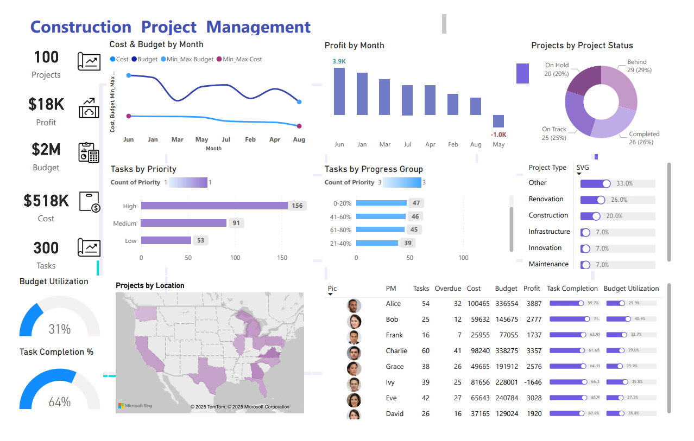
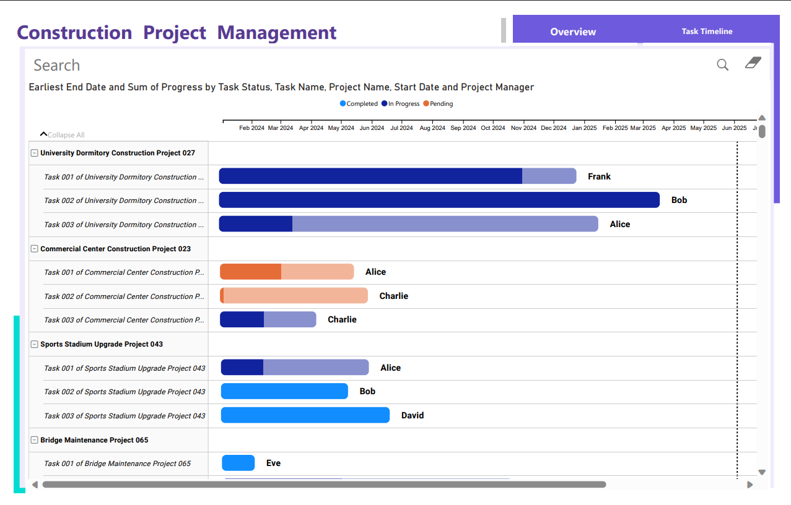

# 🏗️ Construction Project Dashboard

This project showcases a comprehensive **Power BI dashboard** designed to monitor and analyze KPIs related to construction project management. The visualizations offer valuable insights into project costs, budgeting, task prioritization, project progress, and team performance—empowering stakeholders to make data-driven decisions for ongoing improvements and growth.

**Dashboard Overview**  

**Project Timeline**  

##  Tech Stack

- **Power BI Desktop**
- **DAX (Data Analysis Expressions)**
- **Power Query (M Language)**

##  Dashboard Overview

The dashboard is divided into two main sections:

### 1️⃣ Executive Summary (Overview Tab)
Key KPIs and visuals included:
- **Project Metrics**: Total Projects, Budget, Profit, Cost, and Tasks
- **Line Chart**: Monthly trends of budget vs cost
- **Bar Charts**:
  - Profit by Month
  - Tasks by Priority and Progress Group
- **Donut Chart**: Project Status Breakdown (On Track, Behind, Completed, etc.)
- **Utilization Gauges**: Budget Utilization and Task Completion %
- **Map Visualization**: Projects by Geographic Location
- **Table**: PM-wise breakdown of task allocation, overdue work, costs, budget, and performance indicators

### 2️⃣ Project Timeline View (Task Timeline Tab)
A Gantt-style view displaying:
- Start and End Dates of Tasks
- Status: Completed, In Progress, Pending
- Assigned Project Manager
- Timeline view of all projects with visual progress bars

These views provide holistic clarity on project execution, delays, and resource efficiency.

##  Business Impact Summary

The dashboard reveals positive business growth trends:
- The **profit curve**, despite some dips, shows overall upward movement.
- A majority of projects are either **completed or on track** (51%), reflecting efficient project execution.
- **Task completion rate is 64%**, indicating strong workforce productivity.
- **Budget utilization** remains conservative at **31%**, ensuring cost-effective operations.

With this tool, decision-makers can:
- Quickly identify cost overruns
- Monitor team and PM performance
- Prioritize critical tasks
- Address project delays proactively

##  Project Steps

### 1.  Data Collection
- Imported datasets related to projects, costs, tasks, and team members from Excel files.

### 2.  Data Cleaning
- Removed duplicates, nulls, and inconsistent entries.
- Standardized date formats using Power Query transformations.

### 3.  Data Transformation
- Converted raw dates into readable formats (`dd-mmm-yyyy`) to prevent Power BI parsing errors.
- Extracted calculated fields such as `Year`, `Quarter`, `Weekday`, `Task Progress`, and `WeekType`.

### 4.  Data Modeling
- Created relationships between tables (Projects ↔ Tasks ↔ PMs) using unique keys.
- Built a dynamic calendar table with `CALENDARAUTO()` and custom date fields.

### 5.  Visualization
- Utilized bar charts, pie charts, gauges, maps, and matrix tables.
- Implemented conditional formatting and color themes to distinguish performance zones.

### 6.  Design & Interactivity
- Designed a professional layout with grouped KPIs and thematic colors.
- Used bookmarks and slicers for drill-down interactivity and timeline filtering.

## Author
- Manreet Kaur
